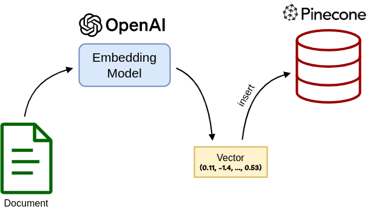
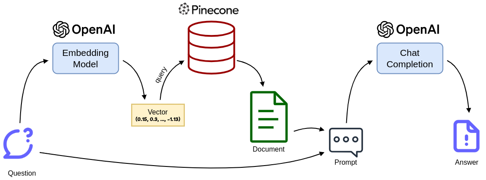

# Answer questions about your documents with OpenAI and Pinecone

In recent years, large language models (LLMs) have made remarkable progress in interacting with humans,
showcasing their ability to answer a wide array of questions.
Trained on publicly accessible internet content, these models have broad knowledge across many different topics.
However, they are limited to information that was available to them during training and thus fail to answer any
questions about specific content from your personal documents.

In this article, we will have a look at how we can overcome this limitation, by combining 
[OpenAI](https://platform.openai.com/docs/overview)'s chat completion model
with a [Pinecone](https://www.pinecone.io/) vector database.
We will first have a look at the general approach and then go into detail and implement an intelligent question
answering system in Python, using the APIs of both OpenAI and Pinecone, which enables the LLM to provide useful
responses to inquiries about personal documents.

## Approach

The core idea of the approach is to use OpenAI's chat completion model to answer questions about our documents.
To do so, we create a prompt that includes the question and the documents and asks the model to answer the question
based on the text contents of these documents.
With this naive idea we face the obstacle that the prompt we can provide as input to the chat completion model is 
limited in length.
Meanwhile, we might have a large number of documents, whose contents combined exceed this limit.
Hence, we first have to filter the documents to find the most relevant ones for the question, in order to reduce the
length to the prompt below the limit.

To find the documents that are relevant for a question we make use of text embeddings.
Text embeddings are high-dimensional numerical vectors that represent the meaning of a text in such a way, that
semantically related texts are close to each other in the vector space.
We can use an embedding model to embed all our documents, resulting in a vector for each document.
While different embedding models are available, we will use an embedding model provided by OpenAI via the API.

The resulting vectors are then stored in a vector database.
Vector databases are designed to store and efficiently query large amounts of vectors.
Querying uses an algorithmic approach to find the nearest neighboring vectors to a given query vector
in a database index, using different distance metrics.
In this case, we will use the vector database provided by Pinecone, which is a managed vector database service.




With a Pinecone index filled with our embedded documents, we can now ask questions about their contents.
To do so, we first embed the question using the same embedding model that we used for the documents.
This results in a vector representation of the question, which should be close to the vectors of semantically
related documents, that could provide the information required to answer the question.

By querying the Pinecone index with the embedding vector of the question, we retrieve the nearest document vectors in
the database.
We load the texts of the found documents and combine them to a prompt for the chat completion model, along with the
question text.
Then, we put the prompt into the chat completion model, which will return an answer to our question based on
the texts of the relevant documents.



## Implementation

We will look at an implementation of the question answering approach in a small Python script.
You can find the entire code for the demo on [GitHub](https://github.com/LukasL97/openai-pinecone-search).

### Set up OpenAI and Pinecone

We first need to create accounts and API keys for [OpenAI](https://platform.openai.com/) and
[Pinecone](https://app.pinecone.io/) in the respective developer consoles.
Assuming the API keys are stored in environment variables, we can initialize the OpenAI and Pinecone clients in
our python script.

```python
import os
import openai
import pinecone

openai.api_key = os.getenv("OPENAI_API_KEY")
pinecone.init(api_key=os.getenv("PINECONE_API_KEY"), environment='gcp-starter')
```

### Create the Pinecone index

We can create a Pinecone index either in the Pinecone console or programmatically using the client.
Here, we will do the latter to create an index named *document-search-index*.
The index can be configured with regard to different parameters, most notably the dimensions and the metric.
The dimensions specify the size of the vectors that we will store in the index.
As our embedding model will use vectors of size 1,536, we set the dimensions accordingly.
For the metric we have the choice between *cosine*, *dotproduct* and *euclidean*.
[As the OpenAI documentation recommends using cosine similarity](https://platform.openai.com/docs/guides/embeddings/which-distance-function-should-i-use),
we will use the *cosine* metric.

```python
pinecone_index_name = 'document-search-index'
pinecone.create_index(pinecone_index_name, metric='cosine', dimension=1536)
```

We can also configure the index with regard to the number of pods and pod type.
However, in the free tier we are limited to a single pod and pod type.
The [Pinecone documentation](https://docs.pinecone.io/docs/choosing-index-type-and-size) explains how the index can be
configured in more detail.

### Embed and store your documents in the Pinecone index

Now that we have created the Pinecone index, we can embed and store our documents in the index.
First, we need to load our documents from the disk.
In this case, we assume that the documents are stored in a directory named *data*.
The documents are loaded from the directory and returned as a list of dicts, consisting of the *title* (i.e. the
filename
without ending) and the *content*.

```python
import os

def load_documents():
    documents = []
    documents_path = 'data'
    for filename in os.listdir(documents_path):
        file_path = os.path.join(documents_path, filename)
        with open(file_path, 'r', encoding='utf-8') as file:
            content = file.read()
        documents.append({'title': filename.split('.')[0], 'content': content})
    return documents
```

Next, we need a function to embed the content of a document using OpenAI's embedding model.
The OpenAI client offers an endpoint for that, which allows us to specify an embedding model.
We use the model *text-embedding-ada-002*, which is
[recommended by OpenAI](https://platform.openai.com/docs/guides/embeddings/embedding-models) at the time of
writing this article. The model generates embedding vectors of size 1,536.

```python
import openai.embeddings_utils

def get_embedding_vector_from_openai(text):
    return openai.embeddings_utils.get_embedding(text, engine='text-embedding-ada-002')
```

With the documents and the embedding function, we are now able to fill our Pinecone index with the embedded documents.
The *upsert* method of the Pinecone client expects a list of vectors with *id*, *values* (i.e. the actual vector), and
*metadata*.
The *id* is a unique identifier for each vector in the index and can be used to query a particular vector.
As we won't need this in our use case, we simply set a random value as *id*.
The *metadata* can be any additional information that we want to store together with the vector.
In this case, we store the title of the document as *metadata*.

```python
import time
import uuid

def fill_pinecone_index(documents):
    index = pinecone.Index(pinecone_index_name)
    for doc in documents:
        try:
            embedding_vector = get_embedding_vector_from_openai(doc['content'])
            data = pinecone.Vector(
                id=str(uuid.uuid4()),
                values=embedding_vector,
                metadata={'title': doc['title']}
            )
            index.upsert([data])
            print(f'Embedded and inserted document with title ' + doc['title'])
            time.sleep(1)
        except:
            print(f'Could not embed and insert document with title ' + doc['title'])

documents = load_documents()
fill_pinecone_index(documents)
```

You may note that we have added a `time.sleep(1)` after each embedding and insertion.
This is in order to avoid a rate limit error from OpenAI, which only allows a certain number of tokens to be embedded
per minute.
Further, the embedding model we use is currently limited to texts of up to 8,191 input tokens, which may not be
enough for all documents in *data*.
In this case, we simply skip the embedding and insertion of these document, so that not all our documents will end up
as vectors in the index.
If you have large documents with a lot of text, you may want to consider splitting them into smaller chunks and embed
those individually.

### Answer questions about the documents

To answer questions about our documents, we will first find the relevant ones by querying the Pinecone index, and then
use these documents and combine them with the question into a prompt for the OpenAI chat completion endpoint, 
asking the model to answer the question based on the given text.

To retrieve the relevant documents, we simply embed the question using the same model that we used to embed the
documents.
Then, we query the index with this embedding vector, which will retrieve the top *k* similar vectors in the index.
We set *k* to 1 in this case, as we only answer the question based on a single document.
You may want to use a larger value for *k* to enable the document to take multiple documents into account,
if that is required for your use case.
We fetch the title of the document from the metadata, which will enable us to retrieve the document from the disk.

```python
def query_pinecone_index(query):
    index = pinecone.Index(pinecone_index_name)
    query_embedding_vector = get_embedding_vector_from_openai(query)
    response = index.query(
        vector=query_embedding_vector,
        top_k=1,
        include_metadata=True
    )
    return response['matches'][0]['metadata']['title']
```

We use the title of the document to retrieve the document content from the disk:

```python
def load_document_content(title):
    documents_path = 'data'
    file_path = os.path.join(documents_path, title + '.txt')
    with open(file_path, 'r', encoding='utf-8') as file:
        content = file.read()
    return content
```

We further implement a helper method, to combine the document and the question into a prompt for the chat completion
model:

```python
def create_prompt(question, document_content):
    return 'You are given a document and a question. Your task is to answer the question based on the document.\n\n' \
           'Document:\n\n' \
           f'{document_content}\n\n' \
           f'Question: {question}'
```

Finally, we can use the OpenAI client to ask the chat completion model to answer the question based on the document.
We set the model to *gpt-3.5-turbo-16k*.
This is not the state-of-the-art model, but it is currently cheaper than the different variants of *gpt-4* and should
be sufficient for this use case.
The *16k* version of the model allows for up to 16,385 tokens, which allows us to put long texts into the prompt.
We pass a list of messages to the chat completion model, which consists of the conversation up to this point.
As we start a new conversation, our list consists of a single user message with our prompt as content.
The model returns a list of completion choices, which could be more than one if specified in the request,
but we did not specify a value, hence it defaults to only a single completion.
We extract the message content of the completion, which contains the answer to our prompt.

```python
def get_answer_from_openai(question):
    relevant_document_title = query_pinecone_index(question)
    print(f'Relevant document title: {relevant_document_title}')
    document_content = load_document_content(relevant_document_title)
    prompt = create_prompt(question, document_content)
    print(f'Prompt:\n\n{prompt}\n\n')
    completion = openai.ChatCompletion.create(
        model='gpt-3.5-turbo-16k',
        messages=[{
            'role': 'user',
            'content': prompt
        }]
    )
    return completion.choices[0].message.content

question = input('Enter a question: ')
answer = get_answer_from_openai(question)
print(answer)
```

### Examples

Now we can ask questions about information from out documents and retrieve an answer from OpenAI.
Using some Wikipedia articles about different topics as our example documents, we try out the following question:

> What role does the president play in the political system of Angola?

The Pinecone index yields the vector of the document *Politics of Angola* as most similar to the embedded query.
Using this document in our prompt enables OpenAI to answer the question correctly:

> The president in the political system of Angola holds almost absolute power. They are the head of state and head of government, as well as the leader of the winning party or coalition. The president appoints and dismisses members of the government, members of various courts, the Governor and Vice-Governors of the Nacional Angolan Bank, the General-Attorney and their deputies, the Governors of the provinces, and many other key positions in the government, military, police, intelligence, and security organs. The president is also responsible for defining the policy of the country and has the power to promulgate laws and make edicts. However, the president is not directly involved in making laws.

While this is already impressive, it has to be mentioned that we cheated a little, as we used a Wikipedia article
as our document for testing the system.
As the OpenAI model was trained on publicly available internet content, it is likely that it has seen this exact
article and would have been able to answer the question anyway, even without receiving the document as part of the
input prompt.
Hence, we will have a look at what happens when we ask about a topic that has not been seen by the OpenAI model
before.

To this end, I made up an article about the fictional chemist *Jacob Miller*, who was born in 1850, discovered a
chemical element in 1886, which he named *Jacobium*, received the Nobel Prize for his findings in 1901, and died
in 1932.
You can find the article in the 
[*data* directory of the GitHub repository](https://github.com/LukasL97/openai-pinecone-search/blob/main/data/Jacob%20Miller%20(Chemist).txt).
The document was embedded along with all other documents and inserted into the Pinecone index.
Now, let's have a look at what happens when we ask about Jacob Miller:

> In which year did the discoverer of the chemical element Jacobium win the nobel prize?

As we would expect, the Pinecone index yields the vector of the document *Jacob Miller (Chemist)* as most similar
to the embedded query.
Using this document in the prompt enables the chat completion model to provide the correct answer to the question:

> The discoverer of the chemical element Jacobium won the Nobel Prize in Chemistry in the year 1901.

## Conclusion

As demonstrated in this article, we can combine large language models and vector databases to build intelligent
question answering systems, that are able to answer questions about specific content from our documents.
With managed services like OpenAI and Pinecone, we can easily build such systems without having to worry about
training our own models or setting up and maintaining our own vector database.

As a disclaimer, I want to note that data privacy should be considered when using the approach presented in this article
to build a question answering system on documents that contain sensitive information.
[While OpenAI claims, that they do not train their models on inputs provided vie the API](https://openai.com/enterprise-privacy),
you might still want to consider alternatives when working with private or enterprise data.
Instead of using OpenAI, you could use [one of the many open source LLMs](https://github.com/eugeneyan/open-llms) and
host it yourself, which naturally comes with significantly greater expenses.

Further, Pinecone is not the only vector database service available.
An interesting alternative is the open-source database solution [Chroma](https://www.trychroma.com/), which
actually comes with its own embedding model.
Instead of inserting and querying embedding vectors into the database, Chroma allows us to work with the texts directly,
rendering the use of OpenAI's embedding model unnecessary.
Another alternative is [Faiss](https://faiss.ai/index.html), which is an open-source library for efficient GPU-driven
vector similarity search.
Compared to Pinecone, Faiss lacks the ability to store vectors as it is only a vector index, not a vector database.
Both Chroma and Faiss require you to host a database yourself, which make them somewhat less convenient to use than
the managed Pinecone database.
